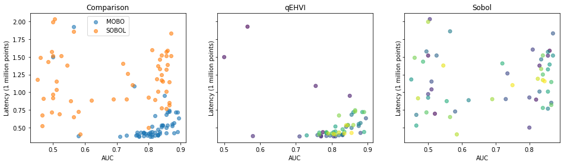
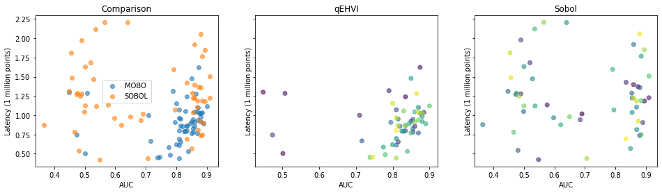

# Multi-objective hyperparameter optimization with Ax

The `ax-for-mo-hpo.ipynb` notebook demonstrates using [Ax](https://ax.dev/) for multi-objective hyperparameter optimization synthetic binary classification task.

In multi-objective hyperparameter optimization, we seek to find the "Pareto frontier" of points representing optimal tradeoffs between multiple objectives. In this example, we trade off prediction latency with predictive performance (area under the ROC curve). The notebook compares a Bayesian optimization algorithm, maximizing the expected hypervolume increase (EHVI) with Gaussian Process models of the objective functions, against quasi-random Sobol search. The output looks like this:

The darker points are those that were sampled earlier, the lighter those that came later.
We can see the qEHVI ("MOBO" in the chart) algorithm progressively finding more points (the lighter ones) in the optimal region of high AUC and low latency.
That's a great result! Alas, it's not always so clear cut. The quasi-random [Sobol](https://en.wikipedia.org/wiki/Sobol_sequence) search is a very strong baseline, and sometimes wins!

Ax is a great toolkit for black-box Bayesian optimization, but as such doesn't make any special affordance for the HPO use case. In the notebook we implement a couple of tips and tricks just for HPO. Try the notebook and explore for yourself!

To get started, install dependencies with `pip install -r requirements.txt`, and run the notebook with your Jupyter environment of choice. (If not using an external Jupyter environment, go ahead and install one with `pip install jupyter`). The notebook was developed against Python 3.8
