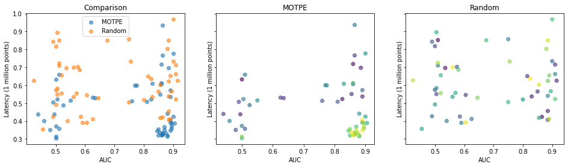
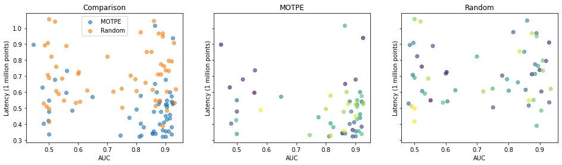

# Multi-objective hyperparameter optimization with Optuna

The `optuna-for-mo-hpo.ipynb` notebook demonstrates using [Optuna](https://optuna.org/) for multi-objective hyperparameter optimization on a synthetic binary classification task.

In multi-objective hyperparameter optimization, we seek to find the "Pareto frontier" of points representing optimal tradeoffs between multiple objectives. In this example, we trade off prediction latency with predictive performance (area under the ROC curve). The notebook compares a Bayesian optimization algorithm: maximizing the expected hypervolume increase (EHVI) using multi-objective tree-structured Parzen estimators (MOTPE), with good old random search. The output looks something like this:

The darker points are those that were sampled earlier, the lighter those that came later.
We can see the MOTPE algorithm progressively finding more points (the lighter ones) in the optimal region of high AUC and low latency.
That's a great result! Alas, it's not always so clear cut that MOTPE finds better points over time.

Try the notebook and explore for yourself!

To get started, install dependencies with `pip install -r requirements.txt`, and run the notebook with your Jupyter environment of choice. (If not using an external Jupyter environment, go ahead and install one with `pip install jupyter`). The notebook was developed against Python 3.8
